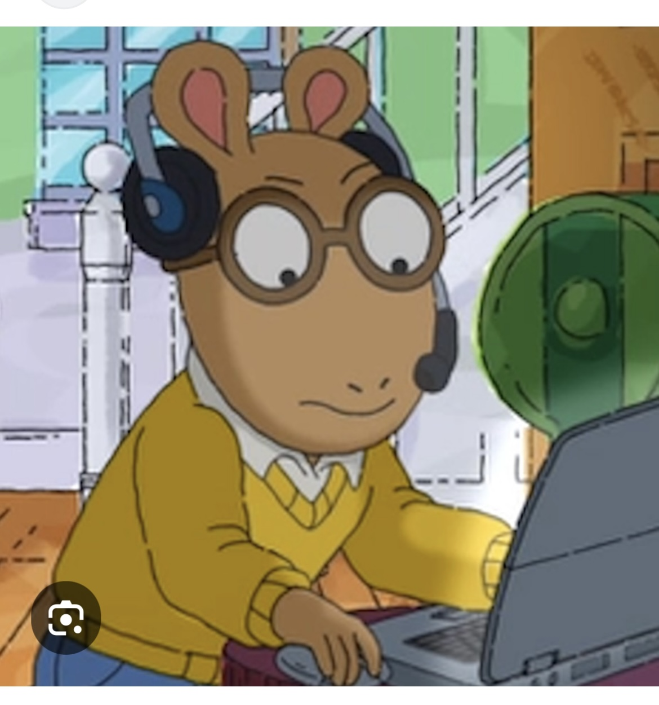

# This is Ruby's awesome website

this is a gif of dw

You can do everything you might usually do. 

that means you can add text, this website is an example coming from [p8105](https://p8105.com/making_websites.html). We're making website today!

Lean more about this site [here](about.html). <- you can jump between pages on your website, but the html file has to be in the same folder. 

I also use [google](https://www.google.com/) for data science. 

Link to the [plots](plots.html).

Here's is a picture. 

- another way to load an image but you can't control the size of it

 
 _yml can set the bar on the top of the website
 build website lets you re-knit everything 
